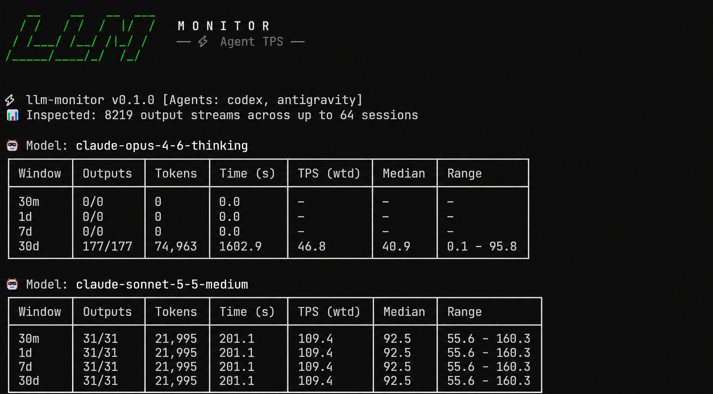
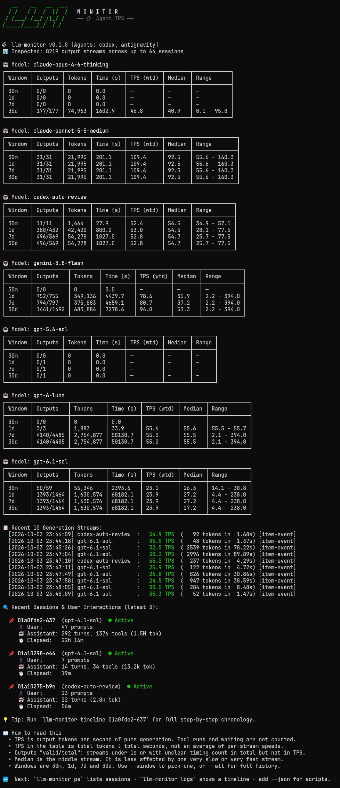
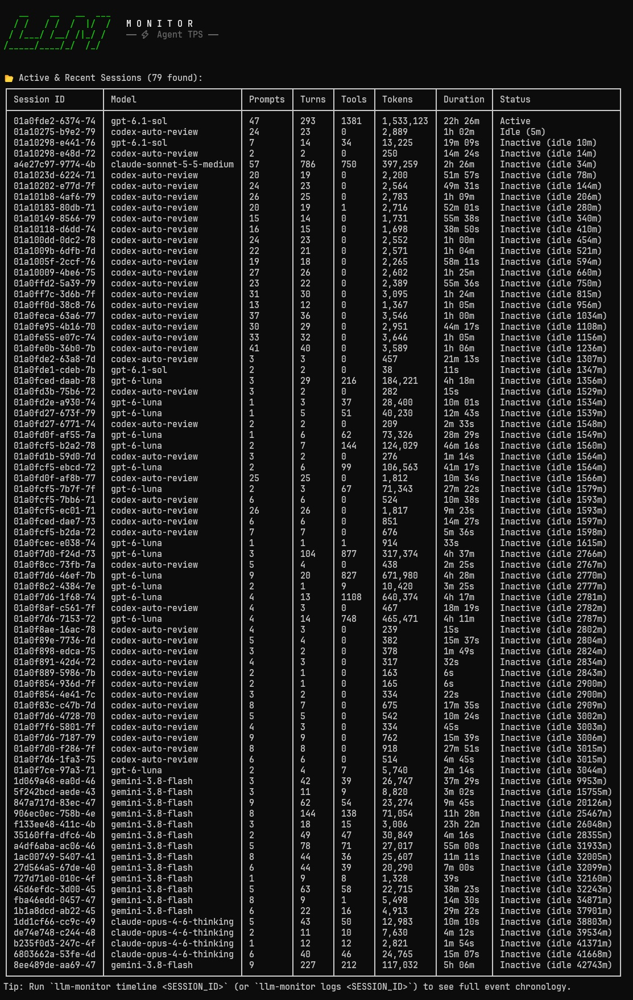
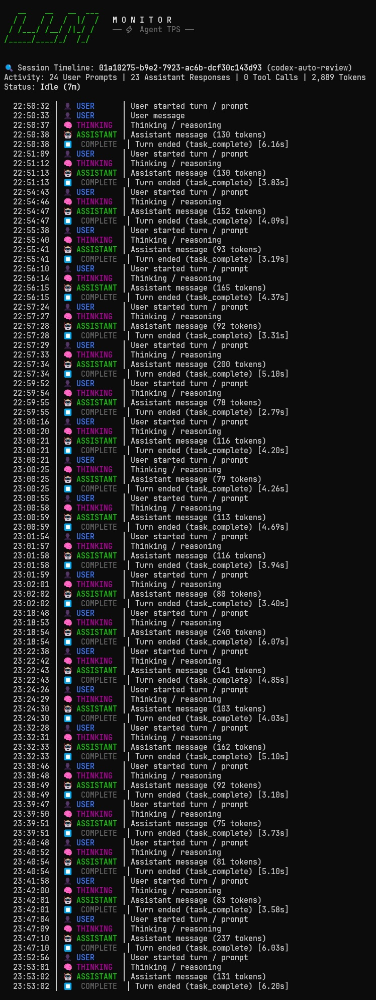

# llm-monitor

A fast, zero-dependency command-line monitor for local AI coding agents.

It measures how fast models actually generate tokens (Tokens Per Second, TPS) by tracking pure generation time—separating thinking and output from tool runs, file edits, and idle waiting.

[](demo-stats.jpg)

[View full screenshots of stats, sessions, and timelines](#screenshots).

---

## Features

- **Real Output Speed**: Measures actual streaming speed (TPS), ignoring tool execution and network idle pauses.
- **Zero Extra Dependencies**: Runs on standard Python 3.10+ without installing third-party packages.
- **Strictly Read-Only**: Safely opens local files and SQLite databases in read-only mode (`?mode=ro`). Never locks or changes your logs.
- **Meaningful Averages**: Calculates true weighted speed ($\frac{\text{total tokens}}{\text{total time}}$), median speed, and min/max ranges over rolling time windows (`30m`, `1d`, `7d`, `30d`, `all`).
- **Supports Popular Agents**: Auto-detects **Codex** (`~/.codex`), **Claude Code** (`~/.claude/projects/`), and **Antigravity** (`~/.gemini/antigravity-cli`).
- **Session Timelines**: Step-by-step history of user prompts, thinking, assistant responses, and tool calls.
- **JSON Ready**: Add `--json` to pipe clean data into `jq` or external dashboards.

---

## Installation

Requires Python 3.10+.

```bash
# Clone the repository
git clone https://github.com/quanhua92/llm-monitor.git
cd llm-monitor

# Run directly with uv
uv run llm-monitor

# Or run tests
uv run python -m unittest discover -s tests
```

---

## Usage

`llm-monitor` uses simple Docker-style subcommands: `stats` (default), `ps` (sessions), `logs` (timelines), and `interactive` (shell).

Running `llm-monitor` by itself defaults directly to `stats`.

### Generation Speed & Metrics (`stats`, `top`, default)

View token throughput (TPS), rolling averages, and recent generation outputs:

```bash
# Auto-detect local agents and show stats (default)
uv run llm-monitor
# or explicitly
uv run llm-monitor stats

# Filter to a specific time window (30m, 1d, 7d, 30d, all)
uv run llm-monitor stats --window 1d

# Include full history beyond the default 30-day cutoff
uv run llm-monitor stats --all

# Target a specific agent or custom folder
uv run llm-monitor stats codex
uv run llm-monitor stats claude --home ~/.claude

# Compact layout for narrow panes or wide full-detail table
uv run llm-monitor stats --compact
uv run llm-monitor stats --wide
```

### Active & Recent Sessions (`sessions`, `ps`, `ls`)

See all recent sessions, message counts, tool runs, and idle status:

```bash
# List recent sessions
uv run llm-monitor ps

# Filter sessions within a time window
uv run llm-monitor ps --window 1d

# Filter to a specific agent
uv run llm-monitor ps codex
```

### Event Timelines (`timeline`, `logs`, `log`)

See the chronological step-by-step history of prompts, model thoughts, responses, and tool calls:

```bash
# View timeline of the latest session
uv run llm-monitor logs

# View timeline of a specific session ID or prefix
uv run llm-monitor logs 01a10275

# Export all session timelines from today in JSON format
uv run llm-monitor timeline --window 1d --json
```

### Interactive Shell (`interactive`, `repl`, `shell`, `-i`)

Open an interactive terminal shell with live auto-refresh and tab completion:

```bash
uv run llm-monitor interactive
# or
uv run llm-monitor -i
```

Available commands inside the shell:
```text
(llm-monitor) summary 30m        # view 30m throughput table
(llm-monitor) sessions           # list active & inactive sessions
(llm-monitor) timeline latest    # view step-by-step event timeline
(llm-monitor) recent 15          # view latest generation speeds
(llm-monitor) watch 2.0 1d       # live auto-refresh dashboard (Ctrl+C to stop)
(llm-monitor) help               # list all commands
```

### Machine-Readable JSON Output

Every command supports `--json` for easy scripting:

```bash
uv run llm-monitor stats --json | jq .
uv run llm-monitor ps --json | jq .
uv run llm-monitor logs 01a10275 --json | jq .
uv run llm-monitor timeline --window 1d --json | jq .
```

---

## Screenshots

Expand a screenshot below. Click the image to view it at full size.

<details>
<summary><strong>stats</strong> — generation speed and token throughput</summary>

[](demo-stats.jpg)

</details>

<details>
<summary><strong>ps</strong> — sessions, activity, and token usage</summary>

[](demo-ps.jpg)

</details>

<details>
<summary><strong>logs</strong> — chronological session timeline</summary>

[](demo-logs.jpg)

</details>

---

## Adding New Adapters

`llm-monitor` uses a clean base class in `src/llm_monitor/adapters/base.py`:

```python
class BaseAdapter(ABC):
    @property
    @abstractmethod
    def name(self) -> str: ...

    @abstractmethod
    def detect(self) -> bool: ...

    @abstractmethod
    def collect(self, max_sessions: int = 64, min_timestamp: float | None = None) -> list[GenerationSpan]: ...

    @abstractmethod
    def collect_sessions(self, max_sessions: int = 32, min_timestamp: float | None = None) -> list[SessionTimeline]: ...
```

To add support for a new agent (e.g. **OpenCode**):
1. Create `src/llm_monitor/adapters/opencode.py` subclassing `BaseAdapter`.
2. Implement discovery (`detect()`), stream parsing (`collect()`), and timelines (`collect_sessions()`).
3. Register it in `src/llm_monitor/adapters/__init__.py`.

---

## License

MIT
